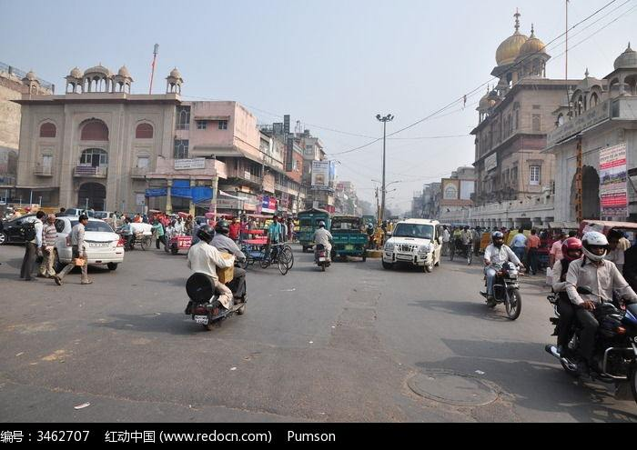
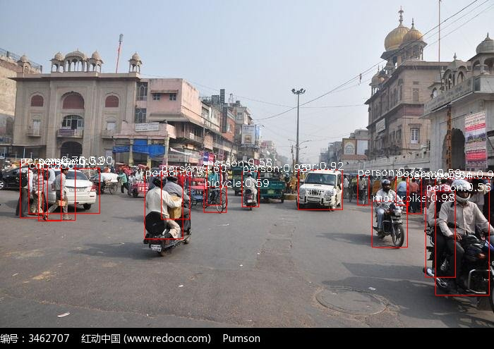

# Use YOLO-V3 By opencv3 or opencv4

## request:
    python3
    opencv-python

## install:
    git clone https://github.com/Rainweic/Regional-Object-Detection.git
    mkdir opencv-yolov3/yolo_v3_config
    cd opencv-yolov3/yolo_v3_config
    wget https://pjreddie.com/media/files/yolov3.weights
    wget https://github.com/pjreddie/darknet/blob/master/cfg/yolov3.cfg?raw=true -O ./yolov3.cfg
    wget https://github.com/pjreddie/darknet/blob/master/data/coco.names?raw=true -O ./coco.names

## test:
    #Testing the Detection Effect of YOLO V3 With Single Picture
    python3 main.py --image test.jpg

  
  
